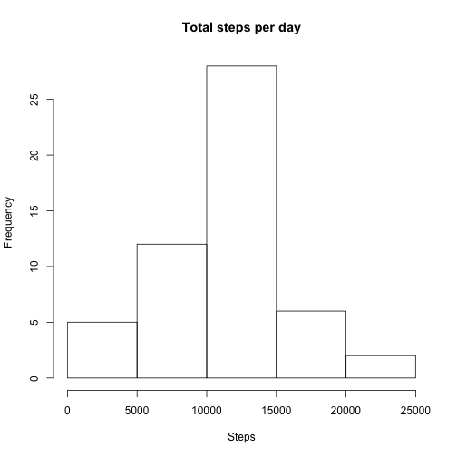
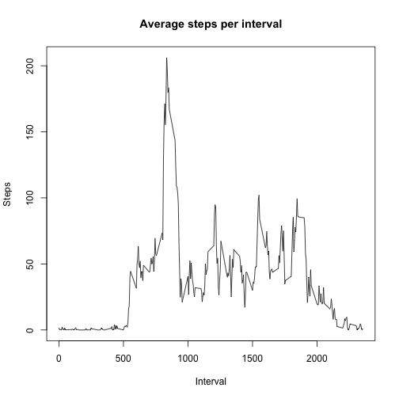
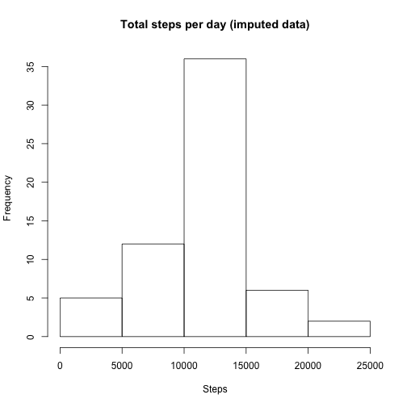
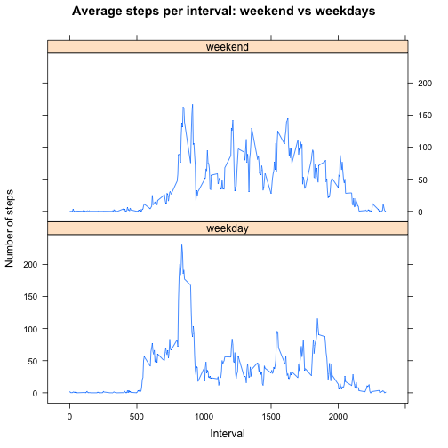

## Loading and preprocessing the data

(1) We import the
[`dplyr`](http://CRAN.R-project.org/package=dplyr),
[`lubridate`](http://www.jstatsoft.org/v40/i03/),
[`xtable`](http://CRAN.R-project.org/package=xtable), and
[`lattice`](http://lmdvr.r-forge.r-project.org) packages:


```r
library(dplyr)
library(lubridate)
library(xtable)
library(lattice)
```

(2) The data are stored in a CSV file in a ZIP archive.  Load the data and parse the dates in year-month-day format:


```r
load.data <- function() {
        con <- unz("activity.zip", "activity.csv")
        d <- tbl_df(read.csv(con, stringsAsFactors = FALSE))
        d$date <- ymd(d$date)
        d
}

data <- load.data()
```

## What is mean total number of steps taken per day?

(1) We compute the total number of steps per day, ignoring entries
where the number of steps is not given:


```r
total_steps_per_day <-
        data %>%
        filter(!is.na(steps)) %>%
        group_by(date) %>%
        summarize(total_steps = sum(steps))
```

(2) We show a histogram of total steps per day:


```r
hist(total_steps_per_day$total_steps,
     main = "Total steps per day",
     xlab = "Steps")
```

 

(3) We compute the mean and median of the total steps per day:

```r
mean_total_steps_per_day <-
        mean(total_steps_per_day$total_steps, na.rm = TRUE)

median_total_steps_per_day <-
        median(total_steps_per_day$total_steps, na.rm = TRUE)
```
- Mean: $1.0766189 &times; 10<sup>4</sup>$.
- Median: $10765$.

## What is the average daily activity pattern?

(1) We compute the averge steps for each interval, ignoring any
missing values:


```r
mean_steps_per_interval <-
        data %>%
        filter(!is.na(steps)) %>%
        group_by(interval) %>%
        summarize(interval_mean = mean(steps, na.rm = TRUE))
```

Then we plot the result:


```r
plot(mean_steps_per_interval,
     type = "l",
     main = "Average steps per interval",
     xlab = "Interval",
     ylab = "Steps")
```

 

(2) We compute the interval that has, on average, the most number of steps:


```r
most_mean_steps_per_interval <-
        which.max(mean_steps_per_interval$interval_mean) %>%
        mean_steps_per_interval$interval[.]
```

We find that interval 835 has the most number of steps.

## Imputing missing values

(1) The total number of missing values is computed by


```r
total_na <- sum(!complete.cases(data))
total_na
```

```
## [1] 2304
```

(2) We fill in missing values using the global mean for each interval.

(3) These values were previously computed and are stored in the
`mean_steps_per_interval` data frame.

We start with the original data and add an `interval_mean` column
containing these values.  This operation can be done with an "inner
join".  Then, we update the `steps` column with either the mean value
or the existing value based on whether the `steps` value is missing:


```r
imputed_steps <-
        data %>%
        inner_join(mean_steps_per_interval, by = "interval") %>%
        mutate(steps = ifelse(is.na(steps), interval_mean, steps))
```

(4) (a) We make a histogram of the total number of steps taken each day.


```r
total_imputed_steps_per_day <-
        imputed_steps %>%
        group_by(date) %>%
        summarize(total_steps = sum(steps))

hist(total_imputed_steps_per_day$total_steps,
     main = "Total steps per day (imputed data)",
     xlab = "Steps")
```

 

(b) The mean and median values can be computed with the following
code:


```r
mean_total_imputed_steps_per_day <-
        mean(total_imputed_steps_per_day$total_steps)

median_total_imputed_steps_per_day <-
        median(total_imputed_steps_per_day$total_steps)
```

- Mean: $1.0766189 &times; 10<sup>4</sup>$.
- Median: $1.0766189 &times; 10<sup>4</sup>$.

(c) The mean is the same as before but the median has changed:


```r
mean_median_data <- data.frame(
        original = c(mean_total_steps_per_day, median_total_steps_per_day),
        imputed = c(mean_total_imputed_steps_per_day, median_total_imputed_steps_per_day),
        row.names = c("mean", "median")
        )
print(xtable(mean_median_data), type = "html")
```

<!-- html table generated in R 3.1.2 by xtable 1.7-4 package -->
<!-- Sun Apr 19 14:03:38 2015 -->
<table border=1>
<tr> <th>  </th> <th> original </th> <th> imputed </th>  </tr>
  <tr> <td align="right"> mean </td> <td align="right"> 10766.19 </td> <td align="right"> 10766.19 </td> </tr>
  <tr> <td align="right"> median </td> <td align="right"> 10765.00 </td> <td align="right"> 10766.19 </td> </tr>
   </table>

(d) The impact of the missing values is small on global aggregate statistics.  In the data, $13.1147541$ percent of the values are missing.

## Are there differences in activity patterns between weekdays and weekends?

(1) We create a `day_type` column indicating whether a day is a
"weekday" or a "weekend":


```r
day_type <-function(date) {
        labs <- ifelse(weekdays(date) %in% c("Saturday", "Sunday"),
                       "weekend", "weekday")
        factor(labs)
}

steps_per_day_type <-
        imputed_steps %>%
        mutate(day_type = day_type(date))
```

(2) We make a time series plot showing the average number of steps per
interval broken into two types, weekday and weekend.


```r
mean_steps_per_day_type <-
        steps_per_day_type %>%
        group_by(interval, day_type) %>%
        summarize(mean_steps = mean(steps)) %>%
        arrange(interval, day_type)

xyplot(mean_steps ~ interval | day_type,
       data = mean_steps_per_day_type,
       type = "l",
       layout = c(1, 2),
       main = "Average steps per interval: weekend vs weekdays",
       xlab = "Interval",
       ylab = "Number of steps")
```

 
